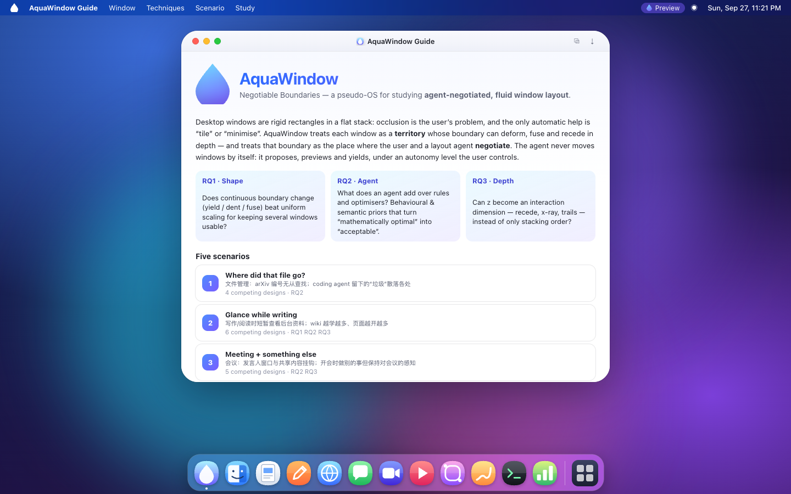
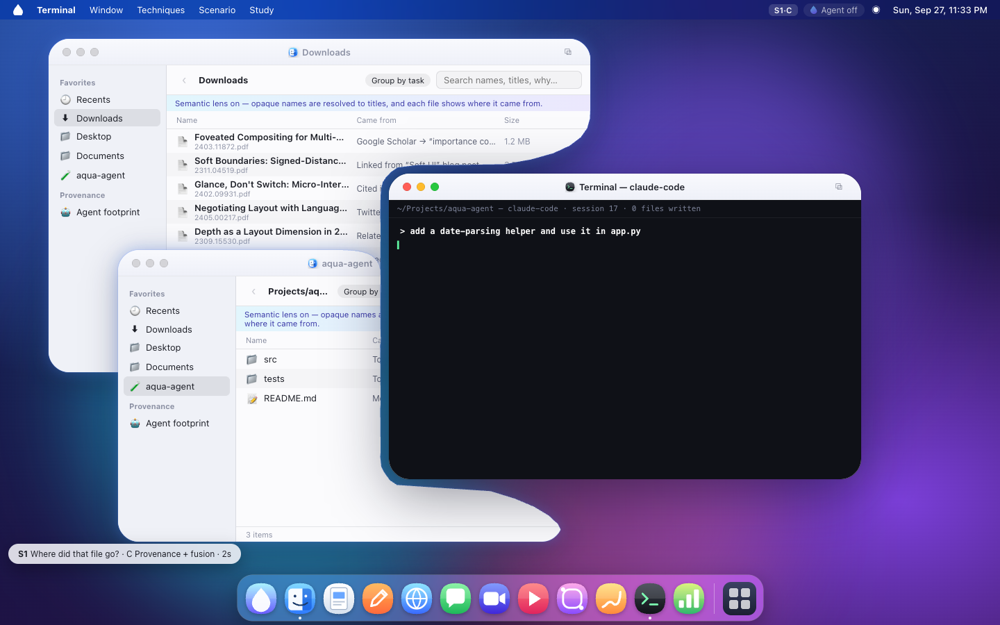
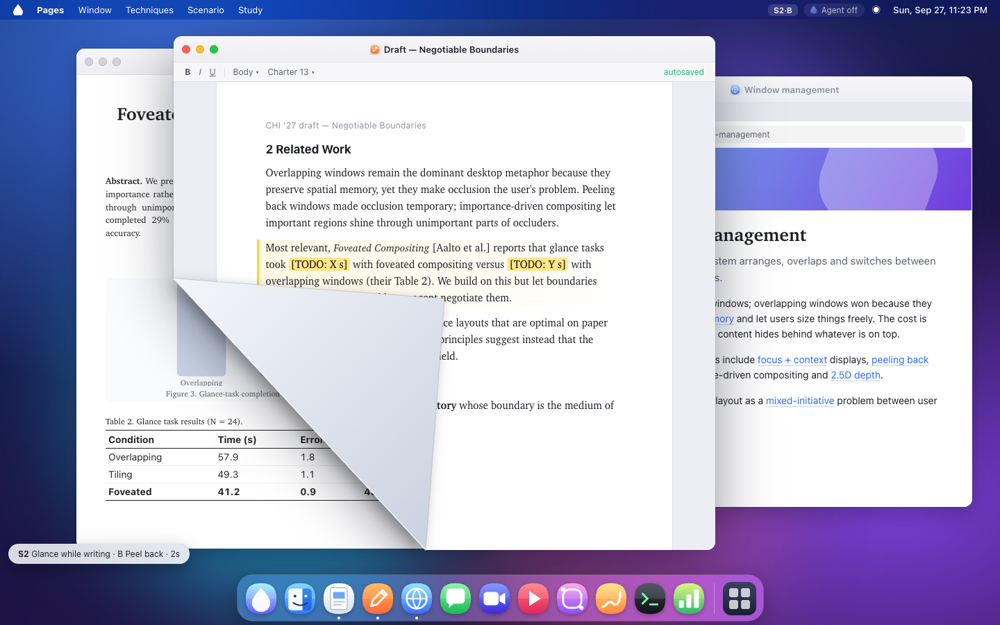
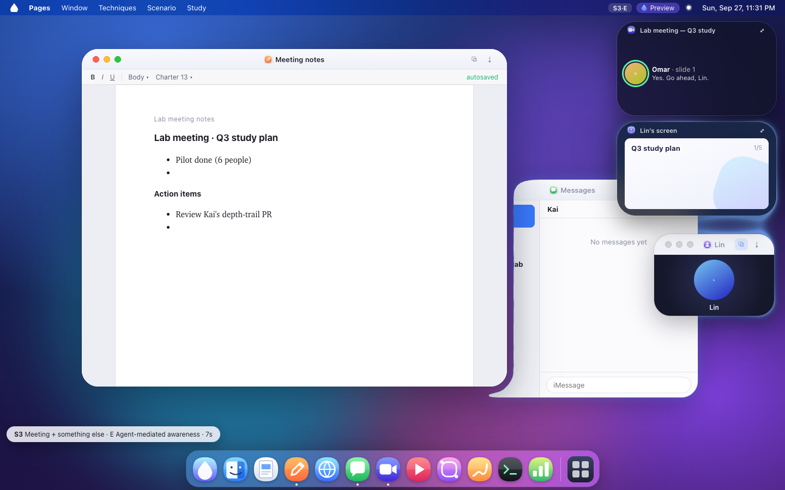
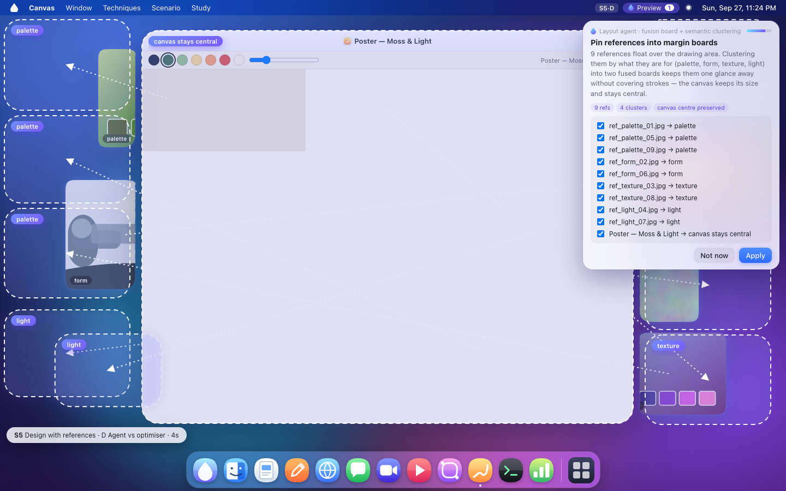

# AquaWindow

一个用来研究 **agent 协商的流体窗口布局** 的伪操作系统桌面。它不是操作系统，也不是又一个平铺窗口管理器：窗口在这里是一块块可以变形、融合、退到深处的**领地**，而领地的边界是人和布局 agent 谈判的地方。

Agent 从不直接改窗口。它只提交 `LayoutProposal`。人在自主度旋钮允许的范围内接受、部分接受、拒绝，或者让它先做、再用一次撤销收回。



## 这个项目在问什么

现有桌面把窗口当成平面上的刚性矩形，遮挡是用户自己的事，系统能给的自动帮助基本只有「平铺」和「最小化」。三件事因此没被好好问过：

1. **形状。** 连续的边界变化（被压到时凹陷、相邻时融合）是否比把整个窗口等比缩小更能让多块内容同时可读？
2. **Agent。** 布局 agent 比规则和数值优化多出来的是什么？纯多目标优化很容易得到「数学上更优、人看起来很怪」的结果，因为它不知道哪扇窗是草稿、哪扇是随手一瞥的资料、人刚把东西放在哪。
3. **深度。** 现有 GUI 几乎全是二维平面。把 z 当成可操作的一维（推远、按住空格看穿、沿深度排列浏览路径）而不是仅仅作为叠放顺序，能不能用？

场景只规定任务、窗口内容、初始位置、遮挡和目标，不规定解法。每种解法是一组可切换的交互技术加一个可选的 agent，方便对照。

## 五种任务

| | 场景 | 困难在哪 | 桌面上可以对照的做法 |
| --- | --- | --- | --- |
| 1 | 文件去哪了 | Downloads 里全是 `2403.11872.pdf` 这种编号；coding agent 把草稿散落到好几个目录 | 普通 Finder / 语义透镜 / 来源与日志互链 / agent 提议 |
| 2 | 边写边看 | 要抄的表格正好压在正在写的段落下面；wiki 越点页面越多 | 重叠 / 掀角回看 / 重要区域透出 / 流体让位 / 缩放对照 / 深度轨迹 / agent |
| 3 | 开会还想干别的 | 发言人和共享屏幕是两个窗口；笔记和消息会把会议埋掉，点名容易错过 | 分开的窗口 / 融合 / 周边胶囊 / 深度 / agent 维持感知 |
| 4 | 边看教程边操作 | 视频要够大才看得清，但每一步的控件在软件的不同位置，视频正好挡住 | 自己摆 / 幽灵穿透 / 流体让位 / 知道步骤的 agent |
| 5 | 设计时看很多参考 | 参考图又小又多，压在画布上挡住笔触，放到后面又找不到 | 浮动窗口 / 按用途融合成板 / 深度层 / agent 对照纯优化器 |

从菜单 **Scenario** 进入，或打开 `http://localhost:5173/?s=glance&st=D` 这类链接（`s` 是场景，`st` 是方案字母）。

## 交互技术从哪来

这些不是装饰，每一项都能单独开关（菜单 **Techniques**，或右上角控制中心），研究条件只是它们的预设。

- **掀角。** 抓住窗口角上的折页往里翻，松手弹回，按住 Shift 再松手可以钉住。来自 Beaudouin-Lafon, *Novel Interaction Techniques for Overlapping Windows*, UIST 2001。
- **重要区域透出。** 被挡住的窗口里真正要紧的区域（表格、图、正在写的段落）从上面那扇窗不重要的部分透出来，上面窗口自己的标题栏和重点不会被挖掉。沿着 Waldner 等人 *Importance-Driven Compositing Window Management*（CHI 2011）的合成思路。
- **非矩形领地。** 窗口表皮是超椭圆（squircle）的零等值面。聚焦的窗口压上来时，下面的窗口边界局部退让，内容不缩放。重叠太深、退让会把窗口吃成一条时，退回普通遮挡，改由 agent 决定要不要挪位置。对照条件是「整窗缩进空隙里」。这一支接 *Interactive Visual Workspaces with Dynamic Foveal Areas and Adaptive Composite Interfaces*（Computer Graphics Forum / Eurographics 2007）里对非矩形工作区的讨论，也参考 DuoZone 一类按区域自适应摆放的想法，但把自适应从「算出一个新矩形」换成「边界本身在谈判」。
- **融合。** 同一组的窗口在 WebGL 里做平滑并集，连成一块液态领地，一起移动；Shift 拖拽把一扇拆出去。分组感来自格式塔的连通性，而不是再画一个框。
- **周边胶囊。** 会议可以收成角落里仍在更新的小胶囊（说话的人、字幕、页码）。思路接近 Robertson 等人的 Scalable Fabric：离开焦点但不离开视野。
- **深度。** `⌥` 加滚轮把窗口推进或拉回 z；按住空格，前面的层变透明（x-ray）；wiki 的链接可以开成一条由近到远的轨迹，再滚轮沿轨迹走。深度是布局的一维，最小化仍然是「拿走」。







## Agent 为什么不是一个优化器

两套求解器走同一个搜索（模拟退火），差别只在目标函数：

- **math** 只惩罚重叠、奖励铺满屏幕。它经常把窗口传到屏幕另一头、压扁长宽比、对调左右。
- **human** 在同一套几何上加上人的先验：刚在用的那扇不动、离原位置近、保持长宽比和左右顺序、参考资料挨着它支撑的主窗口、重要区域不被盖住。

两者的差距就是「怪」的来源，Layout Lab（Dock 里的柱状图图标）会把当前桌面解两次并列出位移、长宽比扭曲、顺序对调和 strangeness。Agent 方案可以预览到桌面上，和规则提议走同一套接受 / 拒绝。

规则 agent 读的是行为和语义，不是只读矩形：短时间在两扇窗之间来回，看成「瞥一眼」而不是「换任务」，于是提议把资料并到草稿旁边；会议被盖住一段时间，收成胶囊；字幕里点到你的名字，再把会议拉回玻璃面；教程的当前步骤对应哪个控件，就把视频挪到对面并保持看得清的尺寸；参考图按 palette / form / texture / light 收成两列。每条提议都带着理由、证据和置信度。置信度会因你拒绝过这一类而下降。

提议可以按窗口部分接受。自主度四档：Off、Suggest（只有一条小提示）、Preview（原位虚线幽灵）、Auto+Undo（先做，toast 上一次撤销）。

后期换成 LLM / VLM 时不改这套协议。设置 `VITE_AGENT_ENDPOINT`（见 `.env.example`）后，控制中心里可以把策略换成 Rules + LLM 或只走远端。远端收到的是一份压缩过的观察 JSON，返回的提案会先做校验（未知窗口丢掉、矩形夹在工作区内、边长有下限），再进入同一个自主度闸门。系统提示词在 `src/agent/llm.ts`。



## 架构

内核是纯 TypeScript，不引用 React，也不引用 agent。上面的东西只通过命令改状态。

```
src/kernel       窗口状态、命令、撤销
src/field        超椭圆 / SDF、退让轮廓、WebGL 融合场
src/techniques   各项交互技术，以及「给定技术和状态，每扇窗长什么样」
src/agent        观察、规则、优化器、LLM 适配、协商控制器
src/apps         模拟的 Finder、论文、写作、wiki、会议、教程、画布、终端
src/scenarios    五个场景：只描述问题，方案是技术开关的预设
src/shell        菜单栏、Dock、窗口、提案卡片、研究台
src/study        JSONL 日志
```

研究台用反引号 `` ` `` 打开：条件、参与者编号、每条规则的接受 / 部分接受 / 拒绝次数、原始日志，以及导出 JSONL。

## 运行

线上演示：<https://shoreee.github.io/AquaWindow/>

需要 Node 20+ 和 pnpm。

```bash
pnpm install
pnpm dev
```

打开 <http://localhost:5173>。

| 操作 | |
| --- | --- |
| 拖标题栏 | 移动；融合组一起动 |
| Shift + 拖 | 从融合组里拆出 |
| 边缘拖拽 | 缩放 |
| 角上折页，或 ⌥ + 拖角落 | 掀角；Shift 松手钉住 |
| ⌥ + 滚轮 | 推进 / 拉出深度；在轨迹上则沿轨迹走 |
| 按住空格 | 看穿前景 |
| ⌥ Tab | 切换窗口 |
| F3 | Mission Control |
| ⌘/Ctrl Z | 撤销一次布局（含 agent 做的） |
| \` | 研究台 |

```bash
pnpm test
pnpm typecheck
pnpm build
```

## 许可

MIT。窗口内容里的论文、会议和文件都是虚构的，用来把任务演出来，不代表真实文献。视觉上参考了 macOS 的桌面习惯（红绿灯、Dock、毛玻璃），没有借用 [playground-macos](https://github.com/purocean/playground-macos) 的代码。
